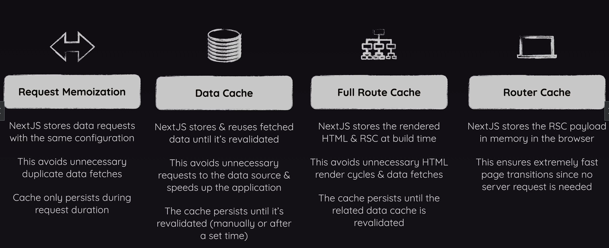

## https://nextjs.org/docs/app/building-your-application/caching

# REQUEST MEMOIZATION (RM)

- Nextjs stores data requests wuth the same confg
- This avoids unncessary duplicate data fetches
- It only happens during 1 request that's being handled on Nextjs server i.e Cache only persists during request duration

# Data Cache

- Managed by Nextjs, RM aims to avoid duplicate requests to data source for single request that's handled by Nextjs server
- DC is all about storing & reusing data that has been fetched from data source if it hasn't changed.
- Nextjs stores & reuses fetched data until it's revalidated
- Idea behind this is not to avoid duplicate request but instead to avoid requests altogether unless the data has changed
- This avoids unnecessary requests to data source & speeds up the application
- The cache persists until it's revalidated(manually or after set time)

# Full Route Cache

- Nextjs stores the entire rendered HTML & RSC at build time
- This avoids unnecessary HTML render cycles & data fetches
- The cache persists until it's revalidated

# Routes Cache

- All other 3 caches are managed on server side, RC is managed on client side
- Nextjs stores the RSC payload in memory in the browser
- This ensures extremely fast page transition since no server request is needed
